<!-- HERO HEADER BANNER (SELF-HOSTED CYBERPUNK SVG) -->

  

<!-- DYNAMIC TYPING SVG ANIMATION -->

 

<!-- CYBER SOCIAL BADGES -->

  
  
  
  
  

---

### SYSTEM CONTROL PANEL

<table>
  <thead>
    <tr>
      <th colspan="5" align="center">INFRASTRUCTURE MONITORING HUD // TELEMETRY NODES</th>
    </tr>
  </thead>
  <tbody>
    <tr>
      <td align="center" width="20%">
        <b>CORE PLATFORM</b> 
        
      </td>
      <td align="center" width="20%">
        <b>CI / CD ENGINE</b> 
        
      </td>
      <td align="center" width="20%">
        <b>CONTAINER MESH</b> 
        
      </td>
      <td align="center" width="20%">
        <b>OBSERVABILITY</b> 
        
      </td>
      <td align="center" width="20%">
        <b>CLOUD FABRIC</b> 
        
      </td>
    </tr>
  </tbody>
</table>

---

### ABOUT THE ENGINEER

> Platform Engineer focused on cloud infrastructure, automation, CI/CD, observability, networking, and developer platforms. Dedicated to building robust, automated, and observable cloud environments through declarative Infrastructure as Code.

 

<table>
  <tr>
    <td align="left" width="30%"><b>Primary Track</b></td>
    <td align="left">Platform Engineering &bull; Cloud Infrastructure &bull; DevOps Automation</td>
  </tr>
  <tr>
    <td align="left"><b>Core Engineering Focus</b></td>
    <td align="left">IaC &bull; Container Orchestration &bull; CI/CD Pipelines &bull; System Observability</td>
  </tr>
  <tr>
    <td align="left"><b>Architecture Blueprint</b></td>
    <td align="left">Declarative, Modular, Self-healing, Observable, Automated</td>
  </tr>
  <tr>
    <td align="left"><b>Supporting Capabilities</b></td>
    <td align="left">Applied Machine Learning &bull; Intelligent Infrastructure Automation</td>
  </tr>
</table>

---

### T-SHAPED PLATFORM ENGINEERING PROFILE

<!-- T-SHAPED SKILLS ANIMATION SVG -->

---

### LIVE DEVELOPER PRESENCE &amp; TELEMETRY

<table>
  <thead>
    <tr>
      <th align="center">DISCORD PRESENCE &amp; SPOTIFY TELEMETRY (LANYARD LIVE STREAM)</th>
    </tr>
  </thead>
  <tbody>
    <tr>
      <td align="center">
        
          
        
        
         
        <b>Real-time Focus:</b> Platform Engineering Enthusiast &bull; Cloud Infrastructure &bull; DevOps &bull; Automation
      </td>
    </tr>
  </tbody>
</table>

---

### ANIMATED INFRASTRUCTURE TERMINAL SESSION

---

### INFRASTRUCTURE AUTOMATION PIPELINE

<table>
  <tr>
    <td align="center">
      
    </td>
    <td align="center"><b>&rarr;</b></td>
    <td align="center">
      
    </td>
    <td align="center"><b>&rarr;</b></td>
    <td align="center">
      
    </td>
    <td align="center"><b>&rarr;</b></td>
    <td align="center">
      
    </td>
  </tr>
  <tr>
    <td align="center" colspan="7"><b>&darr;</b></td>
  </tr>
  <tr>
    <td align="center">
      
    </td>
    <td align="center"><b>&larr;</b></td>
    <td align="center">
      
    </td>
    <td align="center"><b>&larr;</b></td>
    <td align="center">
      
    </td>
    <td align="center"><b>&larr;</b></td>
    <td align="center">
      
    </td>
  </tr>
</table>

---

### PLATFORM ENGINEERING ROADMAP

<table>
  <tr>
    <td align="center"></td>
    <td align="center"><b>&rarr;</b></td>
    <td align="center"></td>
    <td align="center"><b>&rarr;</b></td>
    <td align="center"></td>
    <td align="center"><b>&rarr;</b></td>
    <td align="center"></td>
  </tr>
  <tr>
    <td align="center"></td>
    <td align="center"><b>&rarr;</b></td>
    <td align="center"></td>
    <td align="center"><b>&rarr;</b></td>
    <td align="center"></td>
    <td align="center"><b>&rarr;</b></td>
    <td align="center"></td>
  </tr>
  <tr>
    <td align="center" colspan="4"></td>
    <td align="center" colspan="4"></td>
  </tr>
</table>

---

### TECHNICAL ARSENAL

#### CLOUD &amp; PLATFORM ENGINEERING

  

#### PROGRAMMING &amp; SCRIPTING LANGUAGES

  

#### OBSERVABILITY &amp; NETWORKING

  
  
  
  
  

#### ARTIFICIAL INTELLIGENCE &amp; MACHINE LEARNING (SUPPORTING)

  
  
  
  

#### BACKEND &amp; DEVELOPMENT TOOLS

  

---

### CURRENTLY EXPLORING &amp; CONTINUOUS EVOLUTION

  

---

### FEATURED PLATFORM PROJECT

<table>
  <tr>
    <td align="center">
      <h3>ZENITHOS &mdash; PERSONAL LIFE ASSISTANT PLATFORM</h3>
      
<b>Platform Scope:</b> Software Platform &bull; Automation &bull; CI/CD &bull; Cloud Infrastructure Workflow

      
<b>Stack &amp; Tooling:</b> Node.js &bull; Flutter Client &bull; Docker Engine &bull; GitHub Actions CI/CD &bull; Cloud Infrastructure

      

        <ul>
          <li>Automated container build, linting, and test validation pipeline via GitHub Actions.</li>
          <li>Cloud-ready architectural blueprint with decoupled microservice communication.</li>
          <li>Integrated intelligence layer for automated task assistance and workflow execution.</li>
        </ul>
      

    </td>
  </tr>
</table>

---

### CONTRIBUTION ACTIVITY STREAM

<!-- CONTRIBUTION SNAKE ANIMATION -->
<picture>
  <source media="(prefers-color-scheme: dark)" srcset="https://raw.githubusercontent.com/fendyramadhani9-cloud/fendyramadhani9-cloud/output/github-contribution-grid-snake-dark.svg" />
  <source media="(prefers-color-scheme: light)" srcset="https://raw.githubusercontent.com/fendyramadhani9-cloud/fendyramadhani9-cloud/output/github-contribution-grid-snake.svg" />
  
</picture>

---

### GITHUB TELEMETRY &amp; METRICS

<!-- GITHUB STREAK STATS -->

  

<!-- ACTIVITY GRAPH -->

---

<!-- ANIMATED FOOTER BANNER (SELF-HOSTED CYBERPUNK SVG) -->

