<div align="center">

<!-- ═══════════════════════════════════════════════════════════ -->
<!--                    HERO BANNER                              -->
<!-- ═══════════════════════════════════════════════════════════ -->


<!-- ═══════════════════════════════════════════════════════════ -->
<!--                   TYPING ANIMATION                         -->
<!-- ═══════════════════════════════════════════════════════════ -->


<br/>

<!-- ═══════════════════════════════════════════════════════════ -->
<!--                    SOCIAL LINKS                            -->
<!-- ═══════════════════════════════════════════════════════════ -->

<a href="https://github.com/fendyramadhani9-cloud">
  
</a>
<a href="https://www.linkedin.com/in/fendy-ramadhani9/">
  
</a>
<a href="https://medium.com/@FendyRamadhani">
  
</a>
<a href="https://venzone.web.id">
  
</a>
<a href="mailto:fendyramadhani9@gmail.com">
  
</a>

</div>

---

## SYSTEM CONTROL PANEL

<div align="center">


</div>

---

## ABOUT THE ENGINEER

<div align="center">

```
╔══════════════════════════════════════════════════════════════════════════╗
║                     PLATFORM ENGINEER INIT SEQUENCE                     ║
╠══════════════════════════════════════════════════════════════════════════╣
║  ROLE    │  Platform Engineering  &  Cloud Infrastructure               ║
║  MISSION │  Build robust, automated, observable cloud environments       ║
║  METHOD  │  Declarative IaC  •  GitOps  •  CI/CD Automation             ║
║  FOCUS   │  Kubernetes  •  Terraform  •  Observability  •  DevEx        ║
╚══════════════════════════════════════════════════════════════════════════╝
```

</div>

---

## LIVE DEVELOPER PRESENCE

<div align="center">

<a href="https://discord.com/users/1272842844847214665">
  
</a>

<br/>


<sub>Fallback: Platform Engineering Enthusiast • Cloud Infrastructure • DevOps • Automation</sub>

</div>

---

## ANIMATED INFRASTRUCTURE TERMINAL

<div align="center">


</div>

---

## T-SHAPED PLATFORM ENGINEERING PROFILE

```
 ╔══════════╦══════════╦════════════╦══════════════╦════════════╗
 ║ LINUX &  ║ NETWORK  ║  POLYGLOT  ║    CLOUD     ║  AI/ML     ║
 ║ OS CORE  ║  & EDGE  ║    DEV     ║   SERVICES   ║  SUPPORT   ║
 ║──────────║──────────║────────────║──────────────║────────────║
 ║ Bash     ║ TCP/IP   ║ Python     ║ AWS          ║ Gemini     ║
 ║ Systemd  ║ DNS      ║ Go         ║ IAM          ║ Ollama     ║
 ║ Kernel   ║ Cloudflare║ TypeScript ║ Edge Mesh    ║ LLM Ops    ║
 ╚══════════╩════╦═════╩════════════╩══════════════╩════════════╝
                 ║
       ┌─────────▼──────────────────────────────────────────┐
       │  INFRASTRUCTURE AS CODE          Terraform • State  │
       ├────────────────────────────────────────────────────┤
       │  CONTAINER ORCHESTRATION    Docker • K8s • K3s     │
       ├────────────────────────────────────────────────────┤
       │  CI/CD & DELIVERY PIPELINES     GitHub Actions     │
       ├────────────────────────────────────────────────────┤
       │  FULL-STACK OBSERVABILITY   Grafana • Netdata      │
       ├────────────────────────────────────────────────────┤
       │  INTERNAL DEVELOPER PLATFORMS   GitOps • DevEx     │
       └────────────────────────────────────────────────────┘
                       PLATFORM ENGINEERING CORE
```

---

## INFRASTRUCTURE AUTOMATION PIPELINE

<div align="center">


<br/><br/>


<br/><br/>


</div>

---

## PLATFORM ENGINEERING ROADMAP

```mermaid
graph LR
    A[Linux Core & Shell]:::done --> B[Networking & DNS]:::done
    B --> C[Containerization]:::done
    C --> D[Terraform IaC]:::done
    D --> E[AWS Cloud Services]:::done
    E --> F[Kubernetes / K3s]:::active
    F --> G[CI/CD Automation]:::active
    G --> H[Full Observability]:::active
    H --> I[GitOps & Argo CD]:::exploring
    I --> J[Internal Developer Platform]:::target

    classDef done fill:#00f0ff,color:#000,stroke:#00f0ff
    classDef active fill:#7000ff,color:#fff,stroke:#7000ff
    classDef exploring fill:#f59e0b,color:#000,stroke:#f59e0b
    classDef target fill:#10b981,color:#000,stroke:#10b981
```



---

## TECHNICAL ARSENAL

<div align="center">

### CLOUD & PLATFORM ENGINEERING


### PROGRAMMING & SCRIPTING LANGUAGES


### BACKEND & DEVELOPMENT TOOLS


### OBSERVABILITY & NETWORKING


### AI / ML (SUPPORTING CAPABILITY)


</div>

---

## CURRENTLY EXPLORING

<div align="center">


<br/>


</div>

---

## FEATURED PLATFORM PROJECT

<div align="center">

```
╔═══════════════════════════════════════════════════════════════════════╗
║         ZENITHOS — PERSONAL LIFE ASSISTANT PLATFORM                  ║
╠═══════════════════════════════════════════════════════════════════════╣
║  SCOPE   │  Software Platform + Automation + CI/CD + Cloud           ║
║  STACK   │  Node.js  •  Flutter  •  Docker  •  GitHub Actions        ║
║  INFRA   │  Containerized  •  Cloud-ready  •  GitOps-compatible      ║
╠═══════════════════════════════════════════════════════════════════════╣
║  › Automated container build & test pipeline via GitHub Actions      ║
║  › Cloud-ready architecture with decoupled microservice comms        ║
║  › Integrated AI layer for automated task assistance & workflow      ║
╚═══════════════════════════════════════════════════════════════════════╝
```

</div>

---

## CONTRIBUTION ACTIVITY STREAM

<div align="center">

<picture>
  <source media="(prefers-color-scheme: dark)" srcset="https://raw.githubusercontent.com/fendyramadhani9-cloud/fendyramadhani9-cloud/output/github-contribution-grid-snake-dark.svg" />
  <source media="(prefers-color-scheme: light)" srcset="https://raw.githubusercontent.com/fendyramadhani9-cloud/fendyramadhani9-cloud/output/github-contribution-grid-snake.svg" />
  
</picture>

</div>

---

## GITHUB TELEMETRY

<div align="center">

<a href="https://github.com/fendyramadhani9-cloud">
  
</a>
<a href="https://github.com/fendyramadhani9-cloud">
  
</a>

<br/><br/>

<a href="https://github.com/fendyramadhani9-cloud">
  
</a>

<br/><br/>

<a href="https://github.com/fendyramadhani9-cloud">
  
</a>

</div>

---

<div align="center">


<br/>


</div>
