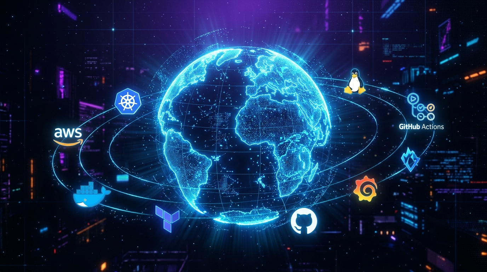

<div align="center">

<!-- HERO BANNER — markdown syntax avoids HTML encoding issues -->


<!-- TYPING ANIMATION -->
;CI%2FCD+%26+DevOps+Pipelines;Kubernetes+%26+Container+Orchestration;Full-Stack+Observability;GitOps+%26+Developer+Platforms)

<br/>

<!-- SOCIAL BADGES -->
[](https://github.com/fendyramadhani9-cloud)
[](https://www.linkedin.com/in/fendy-ramadhani9/)
[](https://medium.com/@FendyRamadhani)
[](https://venzone.web.id)
[](mailto:fendyramadhani9@gmail.com)


</div>

---

## SYSTEM STATUS

<div align="center">


</div>

---

## ABOUT

<div align="center">


<br/>


</div>

---

## LIVE DEVELOPER PRESENCE

<div align="center">

[](https://discord.com/users/1272842844847214665)

<br/>


</div>

---

## INFRASTRUCTURE TERMINAL SESSION

<div align="center">

+since+42+days+ago)

</div>

---

## PLATFORM ENGINEERING SKILLS MAP

<div align="center">



<br/>


</div>

---

## INFRASTRUCTURE AUTOMATION PIPELINE

<div align="center">


<br/><br/>


</div>

---

## PLATFORM ENGINEERING ROADMAP

```mermaid
graph LR
    A["Linux Core"]:::done --> B["Networking & DNS"]:::done
    B --> C["Containerization"]:::done
    C --> D["Terraform IaC"]:::done
    D --> E["AWS Cloud"]:::done
    E --> F["Kubernetes / K3s"]:::active
    F --> G["CI/CD Automation"]:::active
    G --> H["Observability Stack"]:::active
    H --> I["GitOps & Argo CD"]:::exploring
    I --> J["Internal Dev Platform"]:::target

    classDef done fill:#00f0ff,color:#000,stroke:#00f0ff
    classDef active fill:#7000ff,color:#fff,stroke:#7000ff
    classDef exploring fill:#f59e0b,color:#000,stroke:#f59e0b
    classDef target fill:#10b981,color:#000,stroke:#10b981
```



---

## TECHNICAL ARSENAL

<div align="center">

**CLOUD & PLATFORM ENGINEERING**


**PROGRAMMING & SCRIPTING**


**BACKEND & DEV TOOLS**


**OBSERVABILITY & MONITORING**


**NETWORKING**


**AI / ML (SUPPORTING)**


</div>

---

## CURRENTLY EXPLORING

<div align="center">


</div>

---

## FEATURED PROJECT — ZENITHOS

<div align="center">

```
╔═══════════════════════════════════════════════════════════════════╗
║        ZENITHOS — PERSONAL LIFE ASSISTANT PLATFORM               ║
╠═══════════════════════════════════════════════════════════════════╣
║  SCOPE  │  Software Platform · Automation · CI/CD · Cloud        ║
║  STACK  │  Node.js · Flutter · Docker · GitHub Actions           ║
║  INFRA  │  Containerized · Cloud-ready · GitOps-compatible       ║
╠═══════════════════════════════════════════════════════════════════╣
║  › Automated container build & test pipeline via GitHub Actions  ║
║  › Cloud-ready architecture with decoupled microservice comms    ║
║  › Integrated AI layer for automated task assistance             ║
╚═══════════════════════════════════════════════════════════════════╝
```

</div>

---

## CONTRIBUTION SNAKE

<div align="center">

<picture>
  <source media="(prefers-color-scheme: dark)" srcset="https://raw.githubusercontent.com/fendyramadhani9-cloud/fendyramadhani9-cloud/output/github-contribution-grid-snake-dark.svg" />
  <source media="(prefers-color-scheme: light)" srcset="https://raw.githubusercontent.com/fendyramadhani9-cloud/fendyramadhani9-cloud/output/github-contribution-grid-snake.svg" />
  
</picture>

</div>

---

## GITHUB METRICS

<div align="center">

[](https://github.com/fendyramadhani9-cloud)

<br/>

[](https://github.com/fendyramadhani9-cloud)
[](https://github.com/fendyramadhani9-cloud)

<br/>

[](https://github.com/fendyramadhani9-cloud)

<br/>

[](https://github.com/fendyramadhani9-cloud)

</div>

---

<div align="center">


</div>
